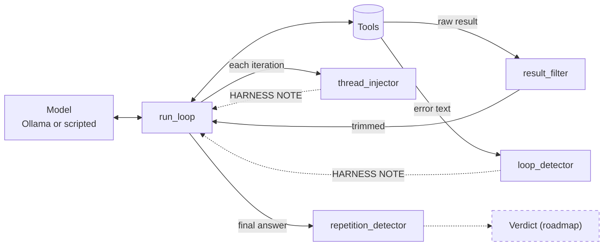

# Karst

Karst is the analyst layer of a digital-forensics pipeline: it reads parsed
evidence and argues a verdict. A local language model does the reasoning, but a
small model given a SQL tool and a question fails in predictable ways, so the
model runs inside a harness of deterministic guards that catch those failures on
every turn. This first public release ships only the guards, a thinking-token
stripper, and a reference loop showing where each guard plugs in. The reasoning
loop that argues the verdict is not in this release; see the roadmap. No LLM
call anywhere in the package. The test suite runs offline in under a second.

In use since May 2026 inside a private pipeline running against real enterprise
telemetry; the guards were built from failures observed there.

## Why Karst?

A karst landscape is a surface shaped by the water flowing beneath it, and an
analyst's conclusions should likewise take their shape from the evidence
underneath. It pairs with `.fulgurite`, a sealed, hash-chained evidence bundle
(roadmap); Karst will read verdict inputs from it.

## 30-second demo

```bash
pip install -e '.[dev]'
python demo.py                    # no model, no GPU: replays scripted turns
python demo.py --model qwen3:8b   # same three scenarios against a live Ollama server
```

Each scenario runs the reference loop twice, unguarded then guarded, against a
toy in-memory database whose errors use DuckDB wording:

```text
A. Context blow-up: a 12-column table with a raw-event blob on every row
   guard under test: result_filter
  mode       iterations    tool_calls    context_chars    injections    end
  unguarded  iterations=2  tool_calls=1  context_chars= 39388  injections=0  end=complete
  guarded    iterations=2  tool_calls=1  context_chars=  1645  injections=0  end=complete
  context saved by guards: 37743 chars

B. The retry loop: the same DuckDB binder error three times (the query referenced a column that does not exist)
   guard under test: loop_detector
  mode       iterations    tool_calls    context_chars    injections    end
  unguarded  iterations=4  tool_calls=3  context_chars=   262  injections=0  end=complete
  guarded    iterations=4  tool_calls=3  context_chars=   724  injections=2  end=complete
    -> [loop_detector @ iter 1] HARNESS NOTE: Your last 2 queries failed with the same error — column 'alert.type' does not exist. Available columns matching 'alert': alert_category, alert_severity, alert_rule. Please revise your query using one of these columns.

C. Losing the thread: one query, then a premature stop
   guard under test: thread_injector, repetition_detector
  mode       iterations    tool_calls    context_chars    injections    end
  unguarded  iterations=2  tool_calls=1  context_chars=  4110  injections=0  end=complete
  guarded    iterations=3  tool_calls=1  context_chars=  4466  injections=2  end=complete
    -> [thread_injector @ iter 0] HARNESS NOTE: You have connection data. Look for associated alerts in the suricata table and check the files table ...
    -> [thread_injector @ iter 1] HARNESS NOTE: You can still use your tools to gather more evidence before concluding. Have you checked all relevant data sources?
```

## Architecture



The guards are independent and sit at seams any loop already has: after every
tool result, after every tool call, once per iteration, and on the final answer.
Every injection is a `user` message prefixed `HARNESS NOTE:` so it shows in traces.

## Use it in your loop

```python
from functools import partial
from karst.harness.guards import LoopDetector, ThreadInjector, detect_repetition, filter_tool_result

result_filter = partial(filter_tool_result, max_chars=2000)
loop_detector, thread_injector = LoopDetector(window_size=5, threshold=2), ThreadInjector(max_iterations=15)
for iteration in range(15):
    turn = model.chat(messages, tools); messages.append(turn.as_assistant_message())
    for call in turn.tool_calls:
        raw, ok = dispatch(call)                                   # your tool dispatch
        messages.append({"role": "tool", "content": result_filter(raw, call.name)})
        if note := loop_detector.record(call.name, raw, ok):
            messages.append({"role": "user", "content": note})
    messages += [{"role": "user", "content": n} for n in thread_injector.check(iteration, bool(turn.tool_calls))]
final = detect_repetition(last_assistant_text(messages)).cleaned_text
```

That snippet is the wiring for a loop you already own. If you do not have one,
`run_loop` in `karst.harness.guards` is the reference implementation the demo
and tests use; pass it the guards as keyword arguments and a `ScriptedModel`
(canned turns) or `OllamaModel` (optional, import-guarded).

## Design notes

Each guard was written after watching one failure mode in traces from a 4B to
30B local model working an incident with a SQL tool. Each is a few dozen lines
with no model in the loop.

| The model... | What was observed | Guard |
|---|---|---|
| **drowns** | One query returned a wide table with a multi-kilobyte raw-event string on every row. The context filled and the model lost what it was investigating. | `result_filter` truncates at row boundaries, keeps the header, flags a configurable list of high-noise columns, and tells the model to "analyze this sample". The earlier wording, "refine your query", caused re-query churn. |
| **spins** | A query failed on a missing column. With the error text in context, the model re-issued the same query verbatim until its budget was gone. | `loop_detector` keeps a sliding window of error signatures. On a repeat past the threshold it injects a diagnostic that lists the columns or tables that actually exist. |
| **drifts** | After a few results, the model stopped calling tools and summarised the last thing it saw, or kept querying one table and never pivoted. | `thread_injector` fires three one-shot nudges: what to correlate next, start concluding near the iteration ceiling, and tools are still available when a turn makes no call. |
| **thinks aloud** | Reasoning models emit `<think>...</think>` spans before the answer, and that text was landing in the final output and in downstream parsing. | `thinking` strips `<think>...</think>` spans from model output so reasoning text never reaches the tool layer. |
| **stutters** | A quantized model repeated one table row or sentence until the token limit. The output looked complete at a glance. | `repetition_detector` catches phrase stutter, duplicate lines and over-repeated sentences in the final answer and truncates at the first repeat with a marker. |

Three rules hold across all five. Nothing in the package calls a model: a guard
that needs an LLM to decide whether the LLM is looping is not a guard. Each
nudge fires once: a guard that repeats itself becomes the noise it was meant to
remove. Error strings are errors: the loop detector classifies on the result
text, not the tool wrapper's success flag.

## Roadmap

- **Reason loop.** The analyst loop that turns guarded tool calls into an argued
  verdict with cited evidence.
- **Eval framework.** Replayable traces scored for correctness, not just
  termination, so guard changes can be measured.
- **`.fulgurite`.** A sealed, hash-chained evidence bundle the analyst layer
  reads from and writes its verdict into.
- **Open-format ingestors.** EVTX and KAPE output, Zeek logs, Plaso timelines.

## Provenance

This code was extracted from a larger private incident-response pipeline, where
these guards run on every model turn. Identifiers were scrubbed, fixtures use
RFC 5737 documentation addresses and invented names, and a scan gate enforces
that in CI.

## Development and CI

```bash
pip install -e '.[dev]'
pytest                 # 90 tests, offline
ruff check .
scripts/ip_scan.sh     # data-hygiene gate; must report zero HIGH/MED hits
```

CI runs the same three steps on Python 3.10 through 3.13. The scan greps every
tracked text file for identifiers that mark a real environment. It also takes
organisation-specific terms that must never appear in the script itself; supply
them through the repository secret `IP_SCAN_PRIVATE_TERMS` as extended regexes
joined with `|`:

```bash
gh secret set IP_SCAN_PRIVATE_TERMS --body 'acme-?corp|ACME\\|internal-project-name'
```

Locally, put the same terms in `scripts/ip_scan.private`, one per line; it is
git-ignored. CI also runs a positive control: the scan must fail when the term
list contains a word known to be in the repo, proving the private-terms path is
live.

## License

Apache-2.0. Copyright 2026 Mark Peters. See `LICENSE`.
